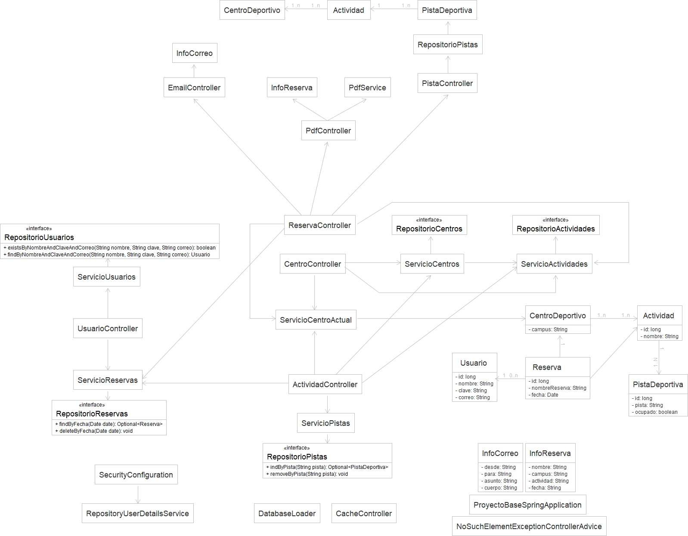
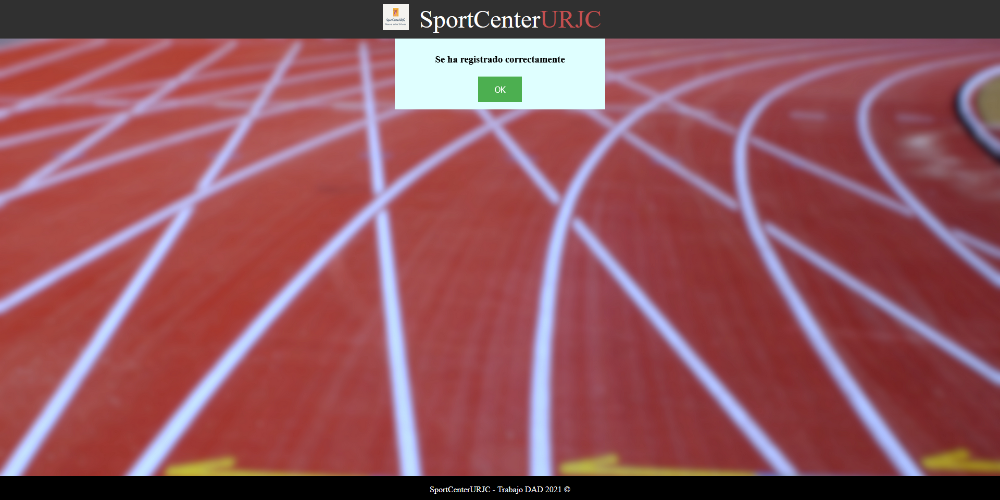
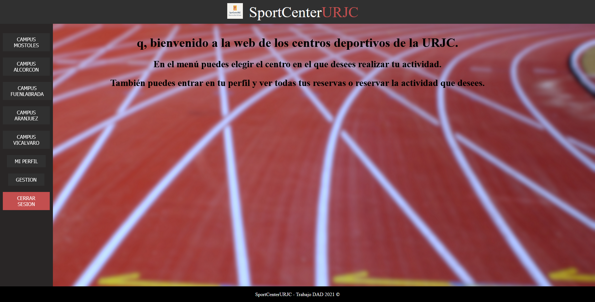
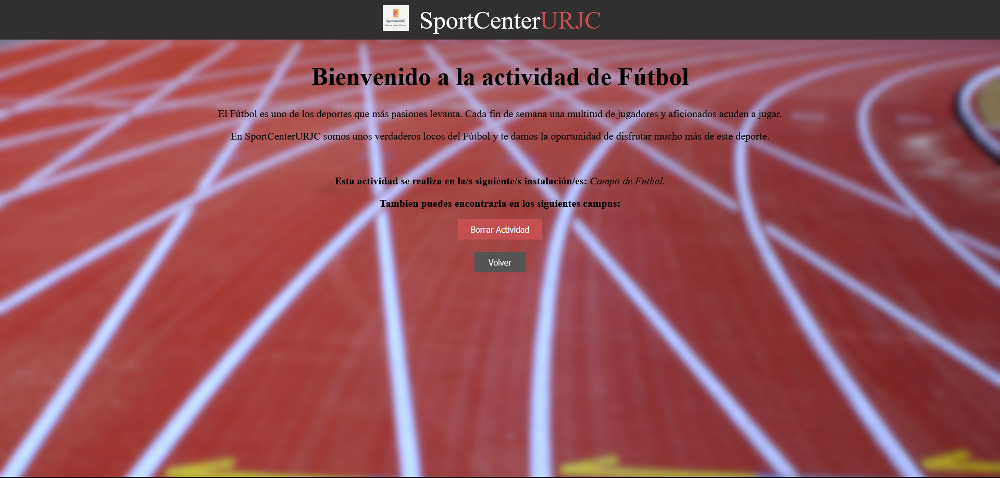
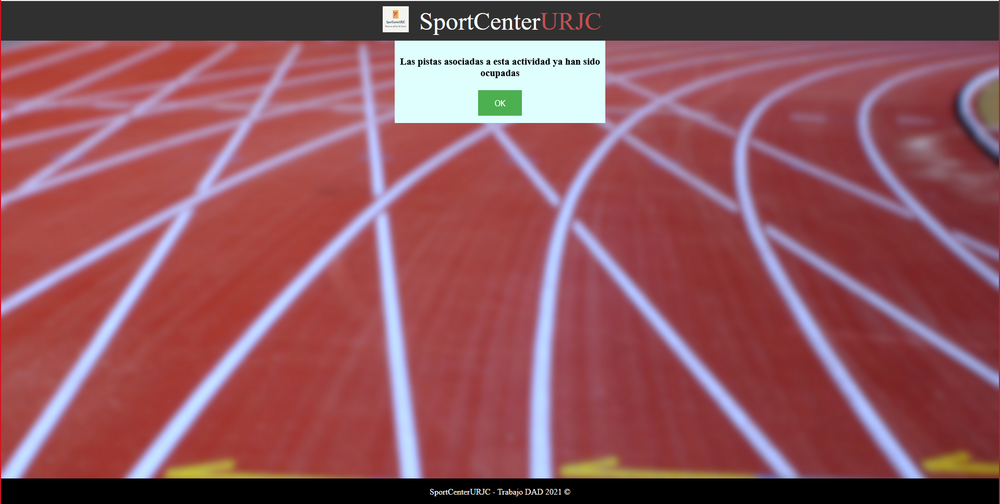
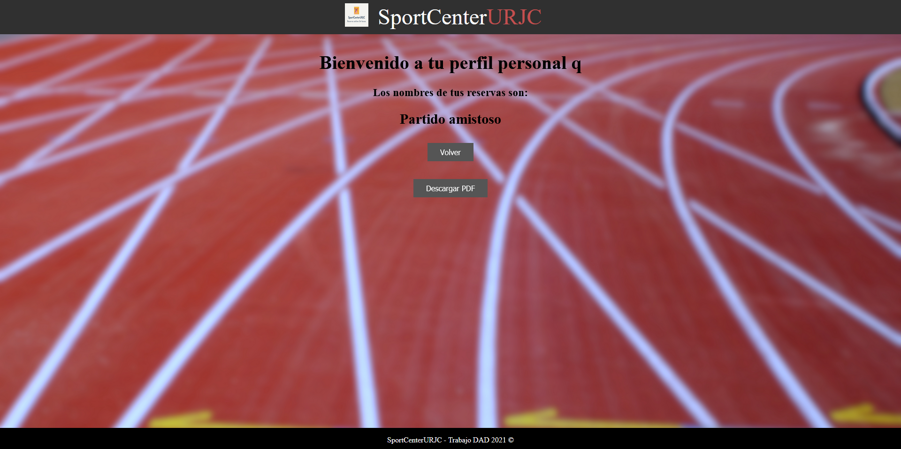
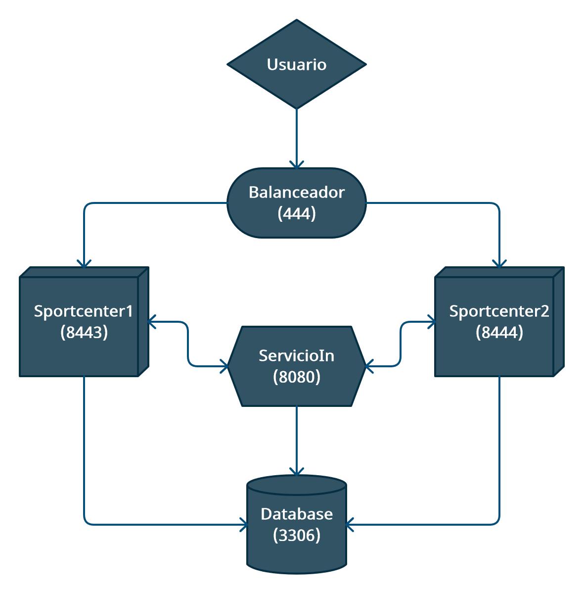

# Video Demostracción
https://www.youtube.com/watch?v=WfYrbFcIZts

# SportCenter_URJC
Consiste en una web que administra y gestiona los centros deportivos de los campus de la URJC. 
- La parte pública consistiria en la navegación libre por la web y la visualizacion de todos sus apartados.
- La parte privada consiste en la gestion por parte de los usuarios de todos los recursos a los que se tenga acceso. 

## Índice
- [Entidades](#entidades)
- [Funcionalidades del servicio interno](#funcionalidades-del-servicio-interno)
- [Diagrama de navegación](#diagrama-de-navegación)
- [Esquema Entidad Relación](#esquema-entidad-relación)
- [Diagrama UML](#diagrama-uml)
- [Capturas de pantalla Fase 4](#capturas-de-pantalla-fase-4)
- [Proceso de instalación de SportCenterURJC en Windows 10](#proceso-de-instalacion-de-sportcenterurjc-en-windows-10)
- [Diagrama Docker](#diagrama-docker)
- [Miembros del equipo](#miembros-del-equipo)

# Entidades 
### Usuario
Representa a los usuarios del sistema que pueden ser alumnos, docentes, trabajadores y administradores de los centros deportivos.
Los usuarios pueden realizar reservas en los distintos centros deportivos.

### Centro deportivo
Representa los diferentes centros deportivos de los distintos campus.
Cada centro deportivo estará constituido por una serie de distintas Actividades disponibles.

### Actividad
Representa los distintos tipos de actividades deportivas disponibles para los usuarios.
Cada actividad está asociada a un centro deportivo y a una/varias pistas deportivas.

### Reserva
Representa la forma en la que un usuario solicita una reserva para una actividad en un centro deportivo.
Está asociada al centro deportivo donde se realiza la reserva, a la actividad reservada y al usuario que realiza la reserva.

### Pista deportiva
Representa todas las distintas pistas/canchas de las distintas actividades que se realizan en los distintos centros deportivos.
Las pistas deportivas están asociadas a las actividades de los centros deportivos.

# Funcionalidades del servicio interno
Generación de mensaje de aviso sobre la disponibilidad de las actividades.
Generación de correo electrónico a la cuenta de la universidad con los datos de la reserva.
Generación de un documento de texto con toda la información relacionada con el usuario (reservas y/o actividades).

# Diagrama de navegación

# Esquema Entidad Relación

# Diagramas UML
### UML General

### UML Aplicación Web

### UML Servicio Interno

# Capturas de pantalla Fase 4
Página inicial de bienvenida

Formulario de registro de usuario nuevo

Plantilla confirmación del registro de usuario

Formulario inicio de sesión de usuario registrado

Página principal de la web

Página de selección de campus

Página de selección de actividad

Página de creación de actividad

Formulario de creación de actividad

Página de borrado de actividad

Aviso de pista ocupada

Formulario de reserva de actividad

Visualización de reserva

Página de cancelación de reserva

Página del perfil del usuario

# Proceso de instalación de SportCenterURJC en Windows 10

Información:

- Versión proyecto maven: 2.4.2
- Versión compilador java: JavaSE-1.8

Requisitos:

1. Java JDK 8: es necesario tener instalado el java versión 8 en la máquina para poder arrancar los ejecutables.

2. Visual C++ 2019: antes de poder instalar MySQL installer el sistema tiene que tener instalado la versión del Visual C++ 2019 o en adelante. Si ya se tiene esto instalado omitir este paso.

3. MySQL Installer: habrá que instalarse y configurar el servicio MySQL. Para ello una vez instalado el programa hay que añadir el servicio del servidor mysql y configurarlo con el usuario "root" y la contraseña "clave".

4. MySQL Workbench: una vez se tenga instalado el programa, ejecutarlo y conectarlo en MySQL Connections al servicio que se ha configurado en el paso anterior con el usuario y contraseña.

4.1. Crear un schema en el workbench, para ello new -> schema, y ponerle de nombre bdd_sec, que es así como se llama la base de datos de la aplicación de los ejecutables.

5. Arrancar ambos ejecutables jar para crear los procesos java en la máquina. Una vez estén arrancados, se podrá usar la aplicación SportCenterURJC desdeel navegador.

# Diagrama Docker

# Miembros del equipo
- Antonio Francisco Roldan Martin - af.roldan@alumnos.urjc.es - https://github.com/afroldan
- Jorge Molina Tirado - j.molinat.2017@alumnos.urjc.es - https://github.com/JorgeM1404
- Tomasz Wiktor Paterek - tw.paterek.2017@alumnos.urjc.es - https://github.com/konzyy
